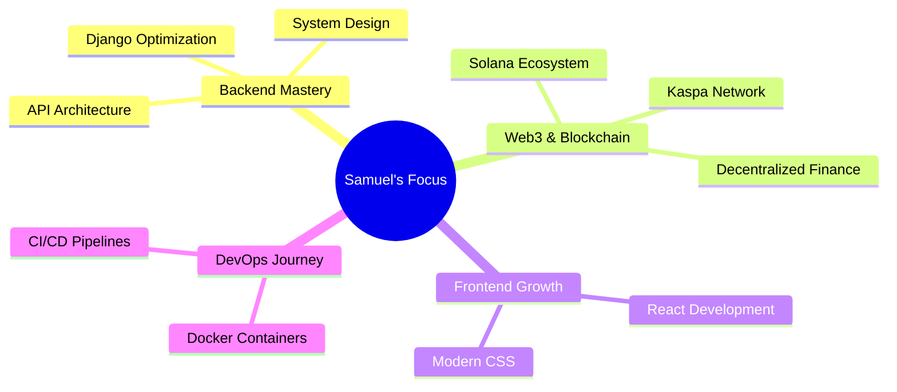

<div align="center">
  
  
  
  

</div>

<div align="center">
  
  [](https://www.python.org/)
  [](https://www.djangoproject.com/)
  [](https://solana.com/)
  [](https://www.postgresql.org/)
  [](https://developer.mozilla.org/en-US/docs/Web/JavaScript)
  [](https://reactjs.org/)
  
</div>

<br/>

<p align="center">
  
</p>

## 🚀 About Me

```python
class SamuelOluwayomi:
    def __init__(self):
        self.username = "SamuelOluwayomi"
        self.role = "Full Stack & Web3 Developer"
        self.location = "Lagos, Nigeria 🇳🇬"
        self.specialization = ["Backend Engineering", "Blockchain", "Django Ecosystem"]
        self.currently_building = ["CadPay (Kaspa Payment Layer)", "Entreefox (Social Media Backend)"]
        self.learning = ["Solana dApps", "Docker", "React", "System Design"]
        self.daily_grind = ["SIWES", "365-Day Coding Challenge"]
        self.open_to = ["Web3 Bounties", "Remote Opportunities", "Freelance Projects"]
    
    def say_hi(self):
        print("Thanks for visiting! Let's build something amazing together 🚀")

me = SamuelOluwayomi()
me.say_hi()
```

<details>
<summary>📊 More About Me (Click to expand)</summary>
<br>

- 🔭 Building scalable backend systems and payment layers like CadPay (complete with a private KAS faucet!).
- 🌱 Currently diving deep into the Solana ecosystem, researching for Superteam Earn quests (Momntum, Cortex Agent, CyreneAI).
- ⚡ Balancing my SIWES program with a rigorous 365-day coding challenge.
- 👯 Open to collaborating on open-source Python, Django, or Web3 projects.
- 💬 Ask me about Django, REST APIs, or my journey into decentralized tech.
- 📫 Reach me: [Add your email or LinkedIn]

</details>

<p align="center">
  
</p>

## 💼 Professional Journey & Projects

<table>
<tr>
<td width="50%">

### ⛓️ Web3 & Blockchain Projects
**Developer & Researcher** • *2025 - Present*

```yaml
🎯 Impact:
  - Building CadPay: A robust payment layer on the Kaspa network.
  - Developed a private KAS faucet for testing.
  - Active participant in Superteam Earn bounties.
  - Deep-dive research on Momntum, Cortex Agent, and CyreneAI within Solana's Internet Capital Markets.
```

</td>
<td width="50%">

### 🌐 Entreefox
**Backend Engineer** • *2025*

```yaml
🎯 Impact:
  - Social media backend (Threads-like platform)
  - RESTful API with JWT authentication
  - User feed algorithm & post management
  - Scalable DRF architecture
  
💻 Tech Stack: 
  - Django REST Framework
  - JWT, PostgreSQL
```

</td>
</tr>

<tr>
<td width="50%">

### 🏢 Tunnel AutoCare
**Freelance Developer** • *2025 - Present*

```yaml
🎯 Impact:
  - Custom CMS for auto repair business
  - Interactive service cards with animations
  - Integrated Google Maps & review system
```

</td>
<td width="50%">

### 🛒 AutoHub
**Full Stack Developer** • *2025*

```yaml
🎯 Impact:
  - E-commerce platform for car parts
  - Advanced filtering & search
  - AJAX-powered cart system & dynamic Masonry layout
```

</td>
</tr>
</table>

<p align="center">
  
</p>

## 🛠️ Tech Stack & Expertise

<div align="center">

### Languages & Core Technologies


### Web3 & Blockchain


### Backend Development


### Frontend Development


### Tools & Platforms


</div>

<p align="center">
  
</p>

## 📊 GitHub Statistics

<div align="center">
  
  
</div>

<div align="center">
  
  
</div>

<p align="center">
  
</p>

## 🎯 Current Focus

<div align="center">



</div>

<p align="center">
  
</p>

## 🤝 Let's Connect

<div align="center">
  
  [](your-linkedin-url)
  [](your-twitter-url)
  [](your-portfolio-url)
  [](mailto:your-email)
  
</div>

<div align="center">
  <br>
  
</div>


<div align="center">
  
  ### 💡 *"Code is like humor. When you have to explain it, it's bad."* – Cory House
  
  **⭐ From [SamuelOluwayomi](https://github.com/SamuelOluwayomi) with ❤️**
  
</div>
