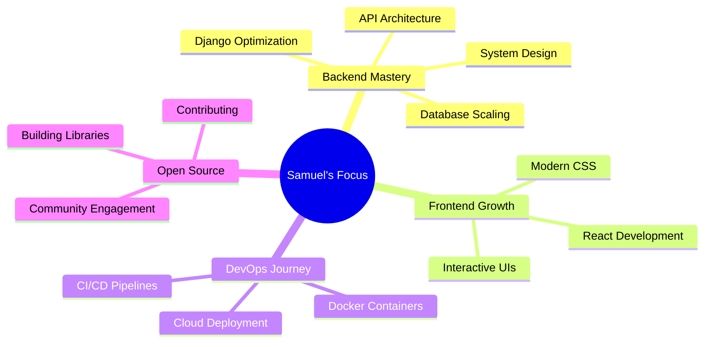

<div align="center">
  
  
  
  

</div>

<div align="center">
  
  [](https://www.python.org/)
  [](https://www.djangoproject.com/)
  [](https://www.postgresql.org/)
  [](https://developer.mozilla.org/en-US/docs/Web/JavaScript)
  [](https://reactjs.org/)
  [](https://getbootstrap.com/)
  
</div>

<br/>


## 🚀 About Me

```python
class SamuelOluwayomi:
    def __init__(self):
        self.username = "SamuelOluwayomi"
        self.role = "Full Stack Developer"
        self.location = "Nigeria 🇳🇬"
        self.specialization = ["Backend Engineering", "REST APIs", "Django Ecosystem"]
        self.currently_working_on = "Entreefox - Social Media Backend"
        self.learning = ["Docker", "React", "System Design"]
        self.open_to = ["Remote Opportunities", "Collaboration", "Freelance Projects"]
    
    def say_hi(self):
        print("Thanks for visiting! Let's build something amazing together 🚀")

me = SamuelOluwayomi()
me.say_hi()
```

<details>
<summary>📊 More About Me (Click to expand)</summary>
<br>

- 🔭 Building scalable backend systems with Django & DRF
- 🌱 Deepening my knowledge in React and containerization
- 👯 Open to collaborating on open-source Python/Django projects
- 💬 Ask me about Django, REST APIs, or backend architecture
- 📫 Reach me: [Add your email or LinkedIn]
- ⚡ Fun fact: I believe clean code is the poetry of programming

</details>


## 💼 Professional Journey

<table>
<tr>
<td width="50%">

### 🏢 Tunnel AutoCare
**Freelance Developer** • *2025 - Present*

```yaml
🎯 Impact:
  - Custom CMS for auto repair business
  - Interactive service cards with animations
  - Integrated Google Maps & review system
  
💻 Tech Stack:
  - Django + PostgreSQL
  - Bootstrap + Custom CSS
  - Cloudinary for media management
```

</td>
<td width="50%">

### 🛒 AutoHub
**Full Stack Developer** • *2025*

```yaml
🎯 Impact:
  - E-commerce platform for car parts
  - Advanced filtering & search
  - AJAX-powered cart system
  - Dynamic Masonry layout
  
💻 Tech Stack:
  - Django + JavaScript
  - Bootstrap + AJAX
  - Session-to-DB cart merge
```

</td>
</tr>

<tr>
<td colspan="2">

### 🌐 Entreefox
**Backend Engineer** • *2025*

```yaml
🎯 Impact:
  - Social media backend (Threads-like platform)
  - RESTful API with JWT authentication
  - User feed algorithm & post management
  - Scalable DRF architecture
  
💻 Tech Stack: Django REST Framework • JWT • PostgreSQL • RESTful Design
```

</td>
</tr>
</table>


## 🛠️ Tech Stack & Expertise

<div align="center">

### Languages & Core Technologies


### Backend Development


### Frontend Development


### Tools & Platforms


</div>


## 📊 GitHub Statistics

<div align="center">
  
  
</div>

<div align="center">
  
  
</div>

<div align="center">
  
</div>


## 🎯 Current Focus

<div align="center">



</div>


## 🤝 Let's Connect

<div align="center">
  
  [](your-linkedin-url)
  [](your-twitter-url)
  [](your-portfolio-url)
  [](mailto:your-email)
  
</div>

<div align="center">
  
</div>


<div align="center">
  
  ### 💡 *"Code is like humor. When you have to explain it, it's bad."* – Cory House
  
  **⭐ From [SamuelOluwayomi](https://github.com/SamuelOluwayomi) with ❤️**
  
</div>
